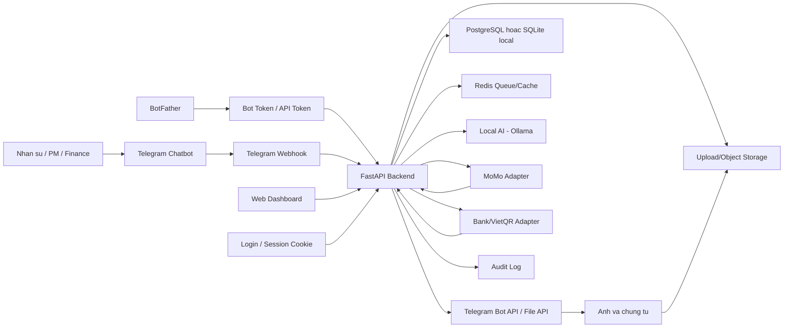

# Kien truc he thong

## 1. Tong quan



## 2. Lop he thong

### Presentation

- Telegram chatbot cho nhap nhanh, gui anh/chung tu, phe duyet, thong bao.
- Web dashboard cho finance, master data, bao cao, cau hinh Telegram/BotFather, ngan hang va MoMo.
- Login page va session cookie cho truy cap noi bo.

### Application

- Workflow de nghi chi
- Authentication va RBAC
- Approval engine
- Budget control
- Payment scheduling
- Reconciliation
- Notification
- AI classification

### Domain

- Company
- User
- Project
- Budget
- ExpenseRequest
- Approval
- Payment
- Transaction
- Vendor
- Attachment
- AuditLog

### Integration

- Telegram Bot API va File API
- BotFather token lifecycle
- MoMo payment/webhook adapter
- Bank statement/webhook adapter
- VietQR/Casso adapter neu ngan hang khong co API truc tiep
- Ollama/local LLM adapter

## 3. Module backend

```text
invmmc
  api
    routes.py
    schemas.py
  core
    config.py
    database.py
    security.py
  domain
    enums.py
    entities.py
    policies.py
  integrations
    bank.py
    local_ai.py
    momo.py
    telegram.py
  services
    approval.py
    budget.py
    expense_intake.py
    reconciliation.py
    reporting.py
    telegram_intake.py
    auth.py
  persistence
    models.py
    bootstrap.py
  static
    dashboard.html
    app.js
    styles.css
  main.py
```

## 4. Du lieu toi thieu

Bang loi:

- users
- user_sessions
- projects
- project_members
- budget_lines
- vendors
- expense_requests
- expense_approvals
- payment_orders
- external_transactions
- reconciliation_matches
- attachments
- transfer_attachments
- integration_configs
- audit_logs

Bang auth/RBAC da implement:

- `users`: email, full_name, password_hash, roles_json, status.
- `user_sessions`: token_hash, user_id, expires_at, revoked_at.
- Cookie session: `invmmc_session`.
- Default admin seed tu `.env`: `ADMIN_EMAIL`, `ADMIN_PASSWORD`, `ADMIN_ROLES`.

Bang Telegram/chung tu:

- `transfer_attachments`: luu metadata anh/chung tu tu Telegram.
- `integration_configs`: luu cau hinh van hanh nhu bot username, webhook URL, provider mode. Khong luu token production tai day.
- File anh local: `data/uploads/telegram`.
- File anh production: object storage hoac file server noi bo co backup.

## 5. Bao mat

Yeu cau toi thieu:

- RBAC theo vai tro va du an.
- Dashboard va API tai chinh yeu cau login.
- Password hash bang PBKDF2, khong luu raw password.
- Session token chi luu hash trong database.
- Upload files duoc bao ve bang route auth, khong mount public static.
- Webhook secret cho Telegram, MoMo, ngan hang.
- Bot Token tu BotFather chi luu trong secret manager hoac `.env`, khong luu trong git.
- Dashboard chi hien token status, bot username, webhook URL va webhook secret da mask/quan tri.
- Signature verification theo tung provider.
- Audit log bat bien cho hanh dong tai chinh.
- Principle of least privilege cho database va API key.
- Khong luu token trong source code.
- IP allowlist cho webhook neu provider ho tro.
- Quyen phe duyet khong duoc trung nguoi tao yeu cau.

## 6. Mo hinh trien khai

Giai doan MVP:

- 1 FastAPI service
- PostgreSQL
- Redis
- Ollama noi bo
- Telegram chatbot qua BotFather token
- Telegram webhook qua HTTPS tunnel hoac reverse proxy
- Upload storage cho anh chuyen khoan

Giai doan san xuat:

- API service tach worker
- Queue cho webhook va AI job
- Backup PostgreSQL hang ngay
- Monitoring log va audit
- VPN/private network cho AI local
- SSO noi bo neu cong ty co Microsoft/Google Workspace
