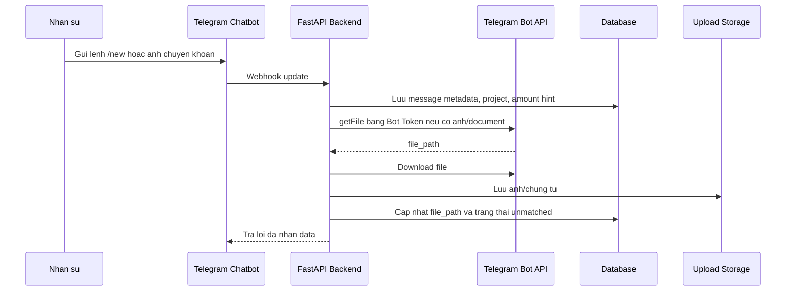

# Chien luoc tich hop Telegram, ngan hang, MoMo va AI local

## 1. Telegram

Telegram dung cho:

- Tao de nghi chi nhanh.
- Gui anh chuyen khoan, hoa don, bien nhan va chung tu.
- Phe duyet/reject/yeu cau bo sung.
- Canh bao vuot ngan sach.
- Nhac tam ung qua han.
- Tra cuu trang thai de nghi.

Telegram se duoc van hanh nhu chatbot noi bo:

- Tao bot bang BotFather.
- Lay Bot Token, con goi la Telegram Bot API Token.
- Dat token vao bien moi truong `TELEGRAM_BOT_TOKEN`.
- Backend dung token de dang ky webhook, gui tin nhan va download file anh/chung tu.
- Du lieu khong luu trong Telegram lam nguon chinh; he thong se luu data vao database va upload storage noi bo.

Lenh de xuat:

```text
/new 1200000 PRJ001 marketing ads Meta invoice#123
/status REQ-2026-0001
/approve REQ-2026-0001
/reject REQ-2026-0001 reason
/budget PRJ001
```

Telegram webhook nen kiem tra secret header va chi chap nhan tu endpoint HTTPS.

Tai lieu: https://core.telegram.org/bots/api

### Luong luu data tu Telegram



Data Telegram luu trong he thong:

- `chat_id`, `message_id`, `file_id`
- caption/noi dung lenh
- project code neu parse duoc
- amount hint neu parse duoc
- duong dan file anh/chung tu
- trang thai doi soat: `unmatched`, `matched`, `rejected`

Khong nen luu Bot Token dang plain text trong database. Neu bat buoc luu cau hinh qua UI, token phai duoc ma hoa bang secret manager/KMS va mask khi hien thi.

## 2. MoMo

MoMo nen duoc boc bang adapter rieng:

- Tao payment request/QR neu doanh nghiep duoc cap API.
- Nhan webhook ket qua thanh toan.
- Xac minh chu ky va trang thai giao dich.
- Ghi external transaction raw payload de audit.

Tai lieu tham chieu: https://developers.momo.vn/v3/

## 3. Ngan hang va VietQR

Vi thuc te moi ngan hang co API doanh nghiep rieng, he thong khong nen hard-code mot ngan hang. Nen tao interface chung:

- `fetch_transactions`
- `verify_webhook`
- `parse_transaction`
- `create_payment_reference`

Neu ngan hang khong co API truc tiep, co the di qua:

- VietQR/Casso cho tao QR va nhan bien dong so du.
- File sao ke CSV/Excel trong giai doan dau.
- Ket noi host-to-host khi len quy mo lon.

Tai lieu VietQR API: https://api.vietqr.vn/en

## 4. AI local

AI local khong duoc tu quyet dinh phe duyet. AI chi ho tro:

- Trich xuat thong tin tu noi dung chat.
- Goi y du an/hang muc.
- Phat hien trung lap.
- Tao tom tat cho nguoi phe duyet.
- Canh bao rui ro dua tren rule va lich su.

Khuyen nghi:

- Ollama noi bo, model 7B-14B tuy may.
- Tat AI voi giao dich nhay cam neu chua co chinh sach du lieu.
- Luu prompt, output, model version trong audit metadata.
- Bat buoc co human approval cho moi khoan chi.

## 5. Data contract webhook noi bo

Moi provider quy ve format chung:

```json
{
  "provider": "momo|bank|vietqr",
  "external_id": "string",
  "occurred_at": "2026-07-01T10:00:00+07:00",
  "amount": 1200000,
  "currency": "VND",
  "direction": "in|out",
  "counterparty_name": "Vendor A",
  "counterparty_account": "string",
  "description": "INVMMC-PRJ001-REQ-2026-0001",
  "raw": {}
}
```

## 6. Rui ro tich hop

- API ngan hang can hop dong doanh nghiep va phe duyet bao mat.
- Webhook co the gui lai nhieu lan, endpoint phai idempotent.
- Telegram Bot Token bi lo se cho phep nguoi khac dieu khien bot, nen phai rotate token ngay tren BotFather.
- Noi dung chuyen khoan co the sai ma, can queue de finance xu ly thu cong.
- MoMo/ngan hang sandbox khac production, khong dung chung secret.
- AI local co the phan loai sai, nen coi nhu recommendation.
