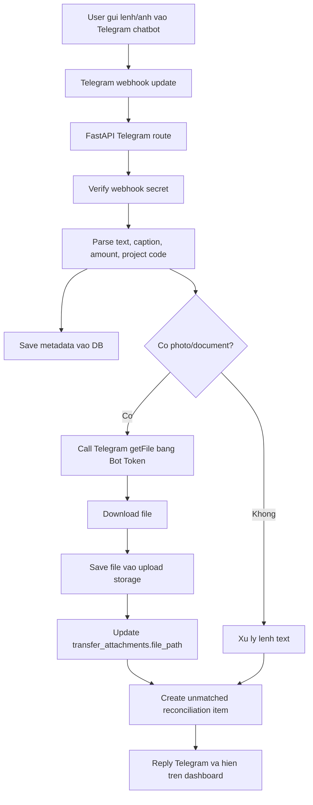

# Telegram chatbot va BotFather token

## 1. Muc tieu

Telegram duoc dung nhu chatbot noi bo de nhan va xu ly du lieu tai chinh theo du an:

- Nhan lenh tao de nghi chi.
- Nhan anh chuyen khoan, hoa don, bien nhan, chung tu.
- Nhan lenh phe duyet hoac tu choi.
- Gui thong bao trang thai, canh bao vuot ngan sach, nhac doi soat.

Bot Token tu BotFather la khoa truy cap Telegram Bot API. Token khong phai database va khong phai noi luu data. Token chi cho phep backend:

- Nhan webhook update.
- Gui message tra loi.
- Goi `getFile` de lay duong dan file tren Telegram.
- Download anh/document tu Telegram ve he thong noi bo.

## 2. Cau hinh BotFather

Buoc thuc hien:

1. Mo Telegram va chat voi `@BotFather`.
2. Tao bot moi bang `/newbot`.
3. Dat ten va username cho bot, vi du `invmmc_finance_bot`.
4. Lay Bot Token.
5. Dat token vao `.env`:

```env
TELEGRAM_BOT_TOKEN=123456789:replace-with-token-from-botfather
TELEGRAM_WEBHOOK_SECRET=replace-with-random-secret
```

6. Cau hinh webhook production bang endpoint HTTPS:

```text
https://your-domain.example.com/telegram/webhook
```

Local development co the dung tunnel nhu Cloudflare Tunnel, ngrok hoac reverse proxy noi bo.

## 3. Cau truc luu data

```text
Telegram Chatbot
  -> Webhook Update
    -> FastAPI /telegram/webhook
      -> parse message/caption/photo/document
      -> save metadata to database
      -> download file via Telegram Bot API
      -> save file to upload storage
      -> create unmatched transfer attachment
      -> notify finance/user
```

Bang/luu tru:

| Du lieu | Noi luu | Ghi chu |
|---|---|---|
| Bot token | `.env` hoac secret manager | Khong commit git, khong luu plain text trong DB |
| Webhook secret | `.env` hoac secret manager | Dung de xac minh request |
| Bot username | `integration_configs` | Co the cau hinh qua dashboard |
| Webhook URL | `integration_configs` | Co the cau hinh qua dashboard |
| Message metadata | `transfer_attachments` | `chat_id`, `message_id`, `file_id` |
| Anh/chung tu | `data/uploads/telegram` local | Production nen dung object storage |
| Trang thai doi soat | `transfer_attachments.status` | `unmatched`, `matched`, `rejected` |

## 4. Data flow chi tiet



## 5. Quyen va bao mat

Quy tac bat buoc:

- Token that chi nam trong `.env`, secret manager hoac CI/CD secret.
- Khong log token.
- Khong gui token qua chat noi bo.
- Rotate token tren BotFather neu nghi ngo bi lo.
- Webhook secret phai dai, ngau nhien va khac Bot Token.
- Endpoint webhook phai HTTPS tren production.
- File upload can quet virus neu cho phep PDF/anh tu nguoi dung rong.
- Dashboard chi hien `token_status`, khong hien token raw.

## 6. Lenh chatbot de xuat

```text
/new 1200000 PRJ001 marketing ads Meta invoice#123
/attach PRJ001 1200000
/status REQ-2026-0001
/approve REQ-2026-0001
/reject REQ-2026-0001 reason
/budget PRJ001
/projects                    (alias /duan) danh sach du an
/project new <MA> <ngan sach> <ten>  tao du an moi tren chat
/budget <ma du an>           (alias /ngansach) tong hop thu/chi du an
/pending                     (alias /cho) xem chung tu cho xu ly
/edit <ma|last> type thu|chi (alias /sua) sua ket qua AI
/edit <ma|last> amount <so>
/edit <ma|last> project <ma du an>
/edit <ma|last> doitac|bank|ref|note <gia tri>
/confirm <ma|last>           (alias /xacnhan) xac nhan vao bao cao
```

Flow AI phan tich anh chuyen khoan thu/chi: xem [docs/08](./08-ai-phan-tich-thu-chi.md).

Quy uoc caption khi gui anh:

```text
PRJ001 chuyen khoan 1200000 nha cung cap ABC
```

He thong se parse `PRJ001` lam project code va `1200000` lam amount hint.

## 7. Cau truc module lien quan

```text
src/invmmc/
  api/routes.py                     webhook Telegram va API integration config
  core/config.py                    TELEGRAM_BOT_TOKEN, TELEGRAM_WEBHOOK_SECRET
  integrations/telegram.py          TelegramBotClient, TelegramUpdateHandler
  services/telegram_intake.py       luu metadata va file tu Telegram
  services/expense_intake.py        parse amount, project code tu text/caption
  persistence/models.py             TransferAttachmentModel, IntegrationConfigModel
  static/dashboard.html             tab Integrations va BotFather setup
```
