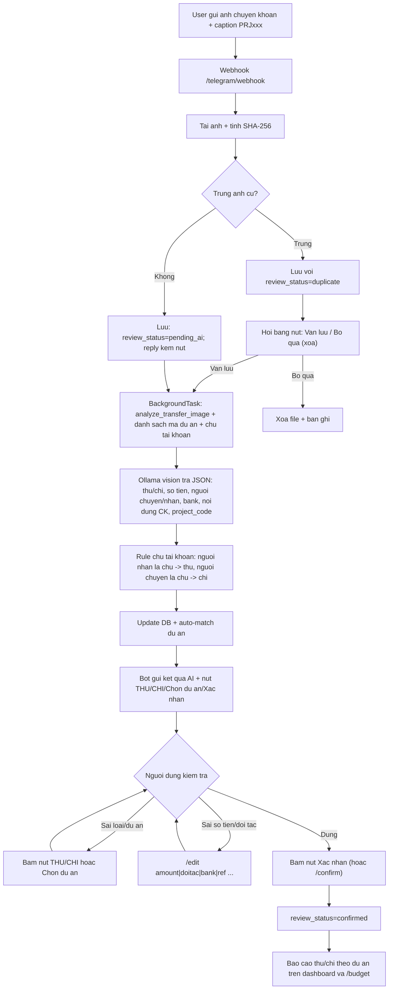

# AI local phan tich anh chuyen khoan thu/chi

## 1. Muc tieu

Nguoi dung gui anh chuyen khoan (bank app, MoMo, VietQR) vao Telegram chatbot. He thong:

1. Tai anh ve upload storage nhu flow hien tai; anh TRUNG (SHA-256 giong ban cu) bi chan lai va hoi qua nut.
2. AI local (Ollama vision model) doc anh va phan loai giao dich la `thu` (tien vao) hoac `chi` (tien ra).
3. Rule chu tai khoan (`OWNER_ACCOUNT_NAMES`): nguoi NHAN la chu tai khoan -> ep `thu`;
   nguoi CHUYEN la chu tai khoan -> ep `chi`. So khop bo dau, khong phan biet hoa thuong.
4. Trich xuat: so tien, nguoi chuyen/nhan, doi tac, ngan hang, noi dung CK, do tin cay - luu cot rieng de sua duoc.
5. Tu dong gan du an: AI nhan danh sach ma du an hop le, doc ma PRJxxx tu caption/noi dung CK;
   caption chua ma khong ton tai se bi canh bao ngay.
6. Bao ket qua ve chat kem NUT bam: THU / CHI / Chon du an / Xac nhan - khong can go cu phap.
7. Xac nhan (nut hoac `/confirm`) yeu cau du: loai thu/chi + so tien + du an; sau do vao bao cao theo du an.
8. Quan ly du an ngay tren chat: `/projects` (co nut xem ngan sach), `/project new`, `/budget <ma>`.

Nguyen tac: AI chi de xuat, con nguoi xac nhan. Chung tu chua xac nhan khong duoc tinh vao bao cao.

## 2. Data flow



## 3. Trang thai chung tu

| Truong | Gia tri | Y nghia |
|---|---|---|
| `transaction_type` | `thu` / `chi` / `unknown` | AI phan loai, nguoi dung sua duoc |
| `review_status` | `pending_ai` | Da luu, dang cho AI phan tich |
| | `pending_review` | AI xong (hoac AI tat), cho nguoi dung sua/xac nhan |
| | `confirmed` | Da xac nhan, duoc tinh vao bao cao du an |
| `status` | `unmatched` / `matched` / `rejected` | Truc doi soat ngan hang, giu nguyen nhu cu |

Sua chung tu da `confirmed` se tu dong quay ve `pending_review` de tranh bao cao sai.

## 4. Cot moi trong `transfer_attachments`

| Cot | Kieu | Ghi chu |
|---|---|---|
| `transaction_type` | VARCHAR(10) | `thu` / `chi` / `unknown` |
| `review_status` | VARCHAR(30) | `pending_ai` / `pending_review` / `confirmed` / `duplicate` (cho quyet dinh anh trung) |
| `file_sha256` | VARCHAR(64) | Hash noi dung anh de phat hien gui trung |
| `counterparty` | VARCHAR(240) | Doi tac (nguoi chuyen/nhan), AI dien, sua bang `/edit doitac` |
| `bank_name` | VARCHAR(120) | Ngan hang, sua bang `/edit bank` |
| `reference` | VARCHAR(240) | Ma giao dich / noi dung CK, sua bang `/edit ref` |
| `note` | TEXT | Ghi chu nguoi dung nhap qua `/edit note` |
| `ai_summary` | TEXT | Tom tat giao dich do AI viet |
| `ai_payload_json` | TEXT | JSON goc AI tra ve (audit) |
| `ai_confidence` | NUMERIC(5,4) | Do tin cay 0..1 |

Migration: SQLite local tu them cot thieu khi khoi dong (`ensure_schema_migrations` trong `persistence/bootstrap.py`). Production PostgreSQL dung cong cu migration rieng.

## 4b. Nut bam (inline keyboard)

Thao tac chinh dung NUT duoi tin nhan, khong can go cu phap:

| Tin nhan | Nut | Tac dung |
|---|---|---|
| Sau khi gui anh / ket qua AI | `THU (tien vao)` `CHI (tien ra)` | Chon loai giao dich |
| | `Chon du an` | Mo danh sach du an de gan (bam ma du an) |
| | `Xac nhan` | Xac nhan vao bao cao (can du loai + so tien + du an) |
| Canh bao anh trung | `Van luu` | Giu ban moi, AI phan tich tiep |
| | `Bo qua (xoa)` | Xoa file va ban ghi vua tao |
| `/start` | `Danh sach du an` `Chung tu cho xu ly` | Menu nhanh |
| `/projects` | `Ngan sach <ma>` | Xem tong hop thu/chi tung du an |
| `/pending` | `Xac nhan <ma>` `Du an` | Xu ly nhanh tung chung tu |

Chi nhap lieu tu do (so tien, ten doi tac, ngan hang, noi dung CK, ghi chu) moi can `/edit`.

## 4c. Chong gui trung anh

- Moi anh tai ve duoc tinh SHA-256 (`file_sha256`); trung voi ban cu -> ban moi luu voi
  `review_status=duplicate`, KHONG chay AI, khong vao bao cao.
- Bot canh bao kem thong tin ban goc (ma, loai, so tien, du an, thoi gian nhan) va hoi:
  `Van luu` (chay AI tiep nhu binh thuong) hoac `Bo qua (xoa)` (xoa file + ban ghi).
- Chung tu `duplicate` khong the xac nhan cho den khi chon `Van luu`.

## 4d. Rule chu tai khoan

```env
OWNER_ACCOUNT_NAMES=DINH QUYET THANH
```

- Nhieu ten phan cach bang dau phay (vd ten ca nhan + ten cong ty).
- AI trich rieng `sender_name` (nguoi chuyen) va `receiver_name` (nguoi nhan) tu anh.
- Nguoi NHAN khop ten chu -> ep `thu`; nguoi CHUYEN khop -> ep `chi` (ghi de ket qua AI,
  ghi chu rule vao `ai_summary`); doi tac tu dong la phia ben kia.
- So khop sau khi bo dau tieng Viet, viet hoa, gop khoang trang ("Đinh Quyết Thành" = "DINH QUYET THANH").

## 4e. Them/sua/xoa chung tu tren dashboard

Tab "Giao dich" (Transfers) tren web:

- Nut "+ Them chung tu": nhap tay chung tu (du an, thu/chi, so tien, doi tac, ngan hang,
  ma GD, thoi gian, ghi chu) kem anh tuy chon. Anh upload cung duoc kiem tra trung
  (sha256 + dhash); trung thi hoi "Van luu?" truoc khi ghi.
- Nut "Sua" tung dong: sua moi truong, ke ca chuyen trang thai Cho duyet <-> Da xac nhan.
  Xac nhan tren dashboard cung bi chan neu thieu loai/so tien/du an nhu tren Telegram.
  Sua noi dung chung tu da xac nhan se tu quay ve trang thai cho duyet.
- Nut "Xoa": xoa ban ghi va file anh kem theo (hoi xac nhan truoc).

API tuong ung: `GET/POST /api/v1/attachments`, `PATCH/DELETE /api/v1/attachments/{id}`
(POST dang multipart, ho tro `force=true` de bo qua canh bao trung).

## 4f. Xuat bao cao Excel/CSV

Tab "Bao cao" (Reports):

- Ky han: Ngay / Tuan / Thang / Nam / Tuy chon (chon tu ngay - den ngay).
- Loc theo du an hoac tat ca du an.
- 2 loai bao cao:
  - Tong hop du an: ngan sach, chi thuc te, telegram_thu, telegram_chi, con lai, % su dung
    (`GET /api/v1/reports/export`).
  - Chi tiet giao dich: tung chung tu voi thu/chi, so tien, doi tac, ngan hang, ma GD,
    trang thai duyet (`GET /api/v1/transfers/export`).

Dinh dang file (`services/report_export.py`):

- Mac dinh xuat **Excel .xlsx co dinh dang**: dong tieu de + ky bao cao + thoi diem xuat,
  header nen xanh dam chu trang, ke bang, dong ke soc xen ke, so tien `#,##0`,
  loai THU chu xanh / CHI chu do, dong TONG CONG (bao cao du an) va
  TONG THU / TONG CHI / CHENH LECH tinh tren chung tu da xac nhan (bao cao giao dich).
- Bao cao chi tiet giao dich **nhung anh chung tu** vao cot cuoi (thumbnail toi da
  110x140 px, JPEG nen ~70%); dong tu gian chieu cao theo anh. Anh mat file thi hien "-".
- Can du lieu tho cho may xu ly: them `&fmt=csv` (CSV co BOM UTF-8).
- Tab "Giao dich" cung co thanh xuat nhanh chi tiet giao dich theo ngay/thang/nam/tuy chon.

## 5. Lenh chatbot

| Lenh | Alias | Chuc nang |
|---|---|---|
| Gui anh + caption `PRJxxx ...` | | Luu chung tu, AI phan tich thu/chi + tu gan du an |
| `/projects` | `/duan` | Danh sach du an: ma, ten, ngan sach |
| `/project new <MA> <ngan sach> <ten>` | | Tao du an moi ngay tren chat |
| `/budget <ma du an>` | `/ngansach` | Tong hop: ngan sach, chi thuc te, THU/CHI Telegram, con lai |
| `/pending` | `/cho` | Xem toi da 5 chung tu chua xac nhan cua chat |
| `/edit <ma\|last> type thu\|chi` | `/sua` | Sua loai giao dich |
| `/edit <ma\|last> amount <so>` | | Sua so tien |
| `/edit <ma\|last> project <ma du an>` | | Gan/chuyen du an (vi du PRJ001) |
| `/edit <ma\|last> doitac <ten>` | | Sua doi tac |
| `/edit <ma\|last> bank <ten>` | | Sua ngan hang |
| `/edit <ma\|last> ref <noi dung>` | | Sua noi dung CK / ma giao dich |
| `/edit <ma\|last> note <ghi chu>` | | Them ghi chu |
| `/confirm <ma\|last>` | `/xacnhan` | Xac nhan, dua vao bao cao du an |

`last` tro den chung tu moi nhat cua chinh chat do.
`/confirm` yeu cau du: loai thu/chi + so tien + du an. Thieu du an se bi chan de bao cao khong lac chung tu mo coi.

Vi du hoi thoai:

```text
User: [gui anh] caption: PRJ001 thanh toan nha cung cap ABC
Bot:  Da nhan anh chuyen khoan. Ma: att-a1b2c3d4e5f6 ... AI dang phan tich...
Bot:  Ket qua AI cho att-a1b2c3d4e5f6: Loai: CHI (do tin cay 92%) So tien: 1.200.000 VND ...
User: /edit last amount 1250000
Bot:  Da cap nhat. ...
User: /confirm last
Bot:  Da xac nhan att-a1b2c3d4e5f6: CHI 1.250.000 VND (PRJ001). ...
```

## 6. Cau hinh AI local

```env
OLLAMA_BASE_URL=http://localhost:11434
OLLAMA_MODEL=qwen2.5:7b-instruct        # model text (goi y phan loai chi phi)
OLLAMA_VISION_MODEL=qwen2.5vl:3b        # model vision (doc anh chuyen khoan)
AI_ENABLED=true
```

- Model vision can pull truoc: `ollama pull qwen2.5vl:3b` (khoang 3 GB, chay duoc CPU).
- May co GPU/RAM manh co the dung `qwen2.5vl:7b` de doc chinh xac hon.
- `AI_ENABLED=false`: he thong van nhan anh, `review_status=pending_review` ngay,
  nguoi dung nhap thu/chi va so tien bang `/edit`. Flow khong phu thuoc AI.
- AI loi/timeout: `transaction_type=unknown`, `ai_summary` ghi ly do, nguoi dung sua tay.

## 7. Cap nhat theo du an

Thu tu gan du an cho chung tu (dung nguon dang tin nhat truoc):

1. Caption chua ma `PRJxxx` ton tai trong DB: gan ngay khi nhan anh.
2. Caption chua ma khong ton tai: canh bao ngay trong reply, kem huong dan `/projects` va `/project new`.
3. AI doc duoc ma du an tu noi dung chuyen khoan trong anh (`project_code` trong JSON): tu gan.
4. Fallback: quet pattern `PRJxxx` trong noi dung CK/tom tat AI tra ve.
5. Van chua co: nguoi dung gan tay `/edit <ma|last> project <ma>`.

`/confirm` bat buoc co du an nen moi chung tu trong bao cao deu thuoc dung mot du an.

- Chi chung tu `confirmed` moi duoc cong don:
  - `projects[].telegram_thu` / `telegram_chi` trong dashboard summary theo ky (day/week/month).
  - KPI tong: `telegram_thu`, `telegram_chi`, `pending_review_attachments`.
- `/budget <ma>` tren chat: ngan sach, chi thuc te tu de nghi chi, THU/CHI Telegram da xac nhan,
  con lai (= ngan sach - chi thuc te - CHI Telegram), so chung tu cho xu ly.
- Truc doi soat ngan hang (`status` unmatched/matched) van chay doc lap nhu truoc.

## 8. Module lien quan

```text
src/invmmc/
  integrations/local_ai.py           analyze_transfer_image, parse_transfer_analysis
  integrations/telegram.py           TelegramBotClient, TelegramUpdateHandler (/start, /new)
  services/telegram_intake.py        store + analyze_and_notify (background), reply builder
  services/telegram_commands.py      /edit /confirm /pending (can DB session)
  services/reporting.py              gom thu/chi theo du an tu chung tu confirmed
  persistence/models.py              TransferAttachmentModel (cot moi)
  persistence/bootstrap.py           ensure_schema_migrations cho SQLite
  api/routes.py                      webhook + BackgroundTasks
scripts/
  telegram_polling.py                bridge getUpdates -> webhook local (khong can tunnel)
```

## 9. Bao mat va gioi han

- Anh chuyen khoan la du lieu nhay cam: chi luu local/object storage noi bo, khong gui ra ngoai.
  AI chay local qua Ollama nen anh khong roi khoi may.
- JSON goc AI luu o `ai_payload_json` de audit vi sao he thong phan loai thu/chi.
- Do tin cay thap (`ai_confidence` < 0.7) nen kiem tra ky truoc khi `/confirm`.
- AI co the doc sai so tien co nhieu so 0; luon doi chieu voi anh goc tren dashboard.
