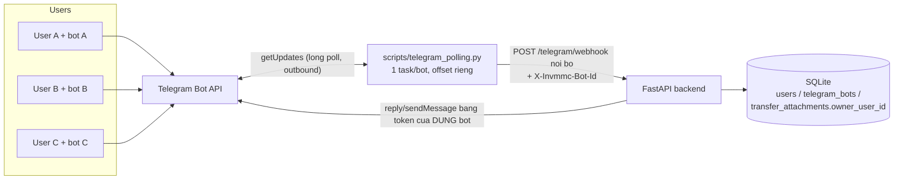

# He thong da nguoi dung: moi user mot bot Telegram

## 1. Muc tieu

- Nhieu nguoi cung dung he thong; admin tao tai khoan va phan quyen tren trang Quan tri.
- Moi nguoi dung so huu MOT bot Telegram rieng: sau khi dang nhap, vao Settings,
  dan token bot (lay tu @BotFather) la xong - khong can cau hinh gi them.
- KHONG dung webhook Telegram: he thong chi long-poll getUpdates cua tung bot
  (outbound-only, khong mo cong, chay duoc sau NAT/localhost).
- Chung tu gui vao bot cua ai thi thuoc ve nguoi do; tai chinh/quan tri thay tat ca.

## 2. Kien truc



- `telegram_bots`: `user_id` (unique - moi user 1 bot), `token` (unique), `bot_id`,
  `bot_username`, `status` (active/invalid).
- `transfer_attachments.owner_user_id`: chung tu thuoc user nao (bot nao nhan duoc).
- Bridge tu lam moi danh sach bot moi 60s: user them/go/doi token khong can restart.
- Offset tung bot luu o `data/telegram_offsets/<bot_row_id>.txt`; bot dau tien
  ke thua offset cu tu `data/telegram_polling_offset.txt`.
- Token cu trong `.env` (TELEGRAM_BOT_TOKEN) duoc tu dong chuyen thanh bot cua
  tai khoan admin khi khoi dong lan dau (migrate mot lan, giu nguyen flow cu).

## 3. Flow nguoi dung moi

1. Admin mo tab **Quan tri** -> `+ Nguoi dung` -> nhap email/ho ten/mat khau + tich vai tro.
2. Nguoi dung dang nhap, mo **Settings** -> the "Bot Telegram cua toi".
3. Tao bot rieng qua @BotFather (`/newbot`) -> copy token -> dan vao o -> **Luu bot**.
   He thong goi `getMe` xac thuc; token sai bi tu choi ngay; token da co nguoi dung -> bao trung.
4. Nhan `/start` voi bot cua minh tren Telegram -> gui anh chuyen khoan nhu binh thuong.
5. Chung tu hien trong tab Giao dich cua ho (user thuong CHI thay chung tu minh gui).

## 4. API

| Endpoint | Quyen | Chuc nang |
|---|---|---|
| `GET /api/v1/me/telegram-bot` | dang nhap | Trang thai bot cua toi (token da che, chi hien 6+4 ky tu) |
| `PUT /api/v1/me/telegram-bot {token}` | dang nhap | Xac thuc getMe roi luu/doi bot |
| `DELETE /api/v1/me/telegram-bot` | dang nhap | Go bot (bridge ngung poll trong <=60s) |
| `GET /api/v1/admin/users` | system_admin | Danh sach user + vai tro + trang thai bot |
| `POST /api/v1/admin/users` | system_admin | Tao user (email, ho ten, mat khau, vai tro) |
| `PATCH /api/v1/admin/users/{id}` | system_admin | Doi ten/vai tro/trang thai (khoa/mo)/mat khau |

Chan tu huy: admin khong the tu bo role `system_admin` hoac tu khoa chinh minh.

## 5. Pham vi du lieu theo vai tro

| Hanh dong | User thuong (employee/project_member) | Finance/Admin |
|---|---|---|
| Xem chung tu (`GET /attachments`) | Chi chung tu `owner_user_id` = minh | Tat ca |
| Sua/Xoa/Xac nhan chung tu | Chi cua minh | Tat ca |
| Them chung tu tren dashboard | Duoc (owner = minh) | Duoc |
| Dashboard summary, bao cao, du an | Khong (403) | Theo FINANCE_READ/WRITE_ROLES |
| Trang Quan tri | Khong | Chi system_admin |

## 6. Bao mat

- Token bot cua tung user: DB local luu plaintext (SQLite noi bo); API chi tra ve
  dang che `888779...L8zM`. Production nen ma hoa cot token hoac dung secret manager.
- Bridge -> backend xac thuc bang `TELEGRAM_WEBHOOK_SECRET` (header) nhu cu;
  them `X-Invmmc-Bot-Id` de dinh danh bot.
- Token bi thu hoi (Telegram tra 401): bridge tu gian doan poll bot do, user chi can
  vao Settings dan token moi.
- Tai khoan bi khoa (`status=disabled`) khong dang nhap duoc; bot cua ho van con
  trong DB nhung co the go boi admin (PATCH user khong xoa bot - go bot la quyen cua user).

## 7. Van hanh

```powershell
# Backend
.\.venv\Scripts\python.exe -m uvicorn invmmc.main:app --host 127.0.0.1 --port 8000
# Bridge da bot (khong can webhook/tunnel)
.\.venv\Scripts\python.exe -u scripts\telegram_polling.py
```

Log bridge co tien to `[bot_username]` cho tung bot. Bot moi duoc nhan trong toi da 60 giay
sau khi user luu token.
